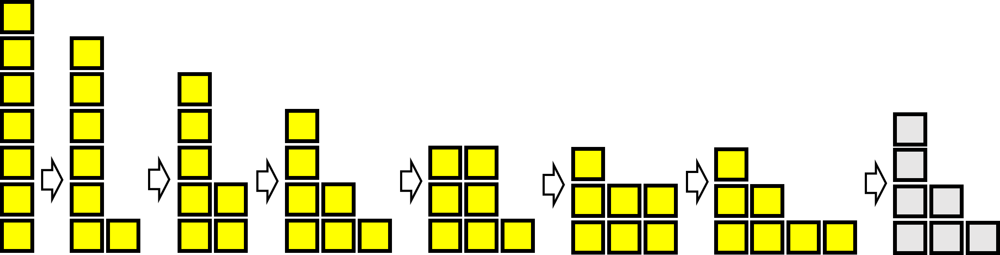

# Bulgarian Solitaire

## Introduction

Bulgarian Solitatire is a simple game, traditionally played with cards which are arranged in piles like the *skyscrapers* in this question. The cards are then rearraged in the same way that King Kong decides to rebuild the city until the sequence terminates. In mathematics we call a sequence like this, where each new member is generated by performing a set of intructions on the last, an *algorithm*.

The nice part about this puzzle is that there are many questions that you could ask about the algorithm which is presented:

How many possible cities are there for some number of blocks?  
What is the longest sequece for a given number of squares?  
How does a sequence using some number of squares end?

Students can (and should) ask their own questions about this puzzle and others as this is a very important skill in mathematics.

## Solution

Here we will discuss the puzzle using 7 squares, you can see the extension section for 6 and 8 squares as well as some general conclustions.

Let us notate the cities in a more concise way by listing the number of squares in each skyscraper from left to right.  
In this way we can write the starting city in the example as (5,2).  
The sequence in the example can be written (5,2) $\rightarrow$ (4,2,1) $\rightarrow$ (3,3,1) $\rightarrow$ (3,2,2) $\rightarrow$ (3,2,1,1) *$\rightarrow$ (4,2,1)*

There are 15 options for a city of 7 blocks are:
(7)  
(6,1)  
(5,2), (5,1,1)  
(4,3), (4,2,1), (4,1,1,1)  
(3,3,1), (3,2,2), (3,2,1,1), (3,1,1,1,1)  
(2,2,2,1), (2,2,1,1,1), (2,1,1,1,1,1)  
(1,1,1,1,1,1,1)  

Using seven blocks, this starting point produces the following sequence:

## Extension
