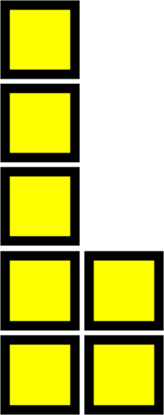
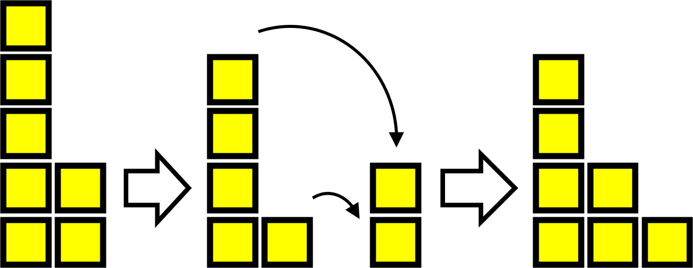
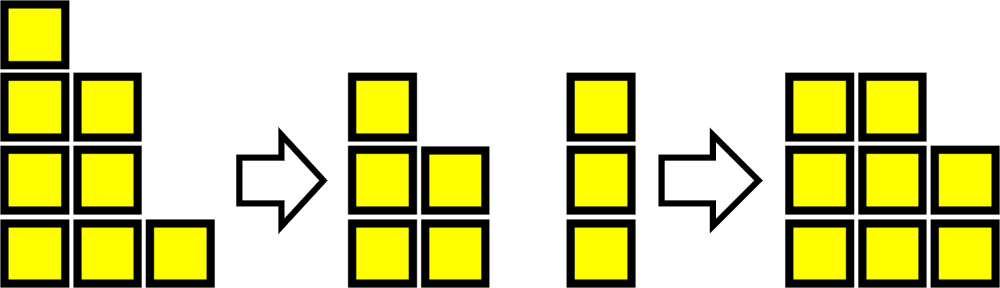
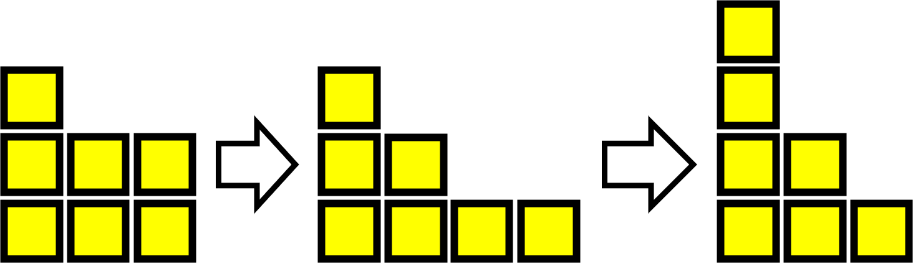

# Bulgarian Solitaire

This question is about a city of skysrapers, like the one below:

Each *skyscraper* is a stack of a certain number of squares and, in a *city*, the skyscrapers are arranged in height order from left to right.

King Kong decides to rearrange the city. To do this, he removes the top block off of each skyscraper and uses the blocks that he has collected to build a new skyscraper. He finishes his new city by arranging the skyscrapers in height order from left to right.

He sits back to admire his work. Then he then decides to repeat the process.

He continues to perform the same rearrangement, generating a new city each time, until he eventually builds a city which he has already seen. In our example, the sixth city is then same as the second.

At this point, still dissatisfied after five reconstructions, King Kong gives up and goes in search of new cities to rebuild.

In the example, the sequence has six different cities. Try starting with different arrangements of seven blocks, what is the longest sequence of cities which you can find? 

What about if you start with a city using six blocks, or eight or nine? What is the longest possible sequence for each number of blocks

As an extenstion, try investigating the possible sequences for each number of blocks. Are there any similarities or rules for all the posible starting cities? In particular, look at how different cities end for each number of blocks.
